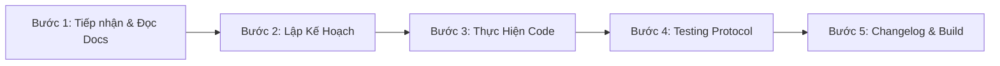

# 🔄 WORKFLOW & TESTING PROTOCOL CHUẨN

> **Quy chuẩn bắt buộc dành cho mọi AI Agent & Developer khi thao tác trên dự án ClassManager Pro.**

---

## 📌 QUY TRÌNH 5 BƯỚC PHÁT TRIỂN (5-STEP DEVELOPMENT WORKFLOW)

### Bước 1: Tiếp Nhận & Đọc Tài Liệu Bắt Buộc
- Khi bắt đầu phiên làm việc mới, Agent **bắt buộc phải đọc file `PROJECT_DOCUMENTATION.md`** để nắm bắt trạng thái kiến trúc và các quy tắc nghiệp vụ.
- Không tự ý thay đổi kiến trúc DB hoặc xóa bỏ các tính năng đã hoàn thiện.

### Bước 2: Lập Kế Hoạch & Xác Định Phạm Vi
- Liệt kê chính xác các file cần tạo mới hoặc chỉnh sửa.
- Kiểm tra tính tương thích ngược với dữ liệu SQLite hiện có.

### Bước 3: Thực Hiện Code & Tối Ưu
- Tuân thủ quy chuẩn TypeScript nghiêm ngặt, không dùng `any` bừa bãi.
- Giao diện Tailwind CSS gọn gàng, hạn chế dùng CSS inline hardcode.
- Dùng SVG icons từ `lucide-react`, không chèn emoji trùng lặp cạnh icon.

### Bước 4: Kích Hoạt Testing Protocol (Rà Soát Toàn Diện Trước Build)
Mọi thay đổi trước khi bàn giao đều phải trải qua 4 bước kiểm thử:

1. **Rà Soát Code & CSS**:
   - Dọn dẹp toàn bộ import thừa, biến không dùng.
   - Kiểm tra các thẻ UI có bị vỡ layout trên màn hình TV (1920x1080) và Mobile (375px) không.
2. **Kiểm Thử Thao Tác Thực Tế (CRUD & Relations)**:
   - Thử nghiệm kịch bản Thêm/Sửa/Xóa.
   - Mọi hành động Xóa bắt buộc phải hiển thị `ConfirmDialog`.
   - Kiểm tra các liên kết khóa ngoại (`ON DELETE CASCADE`) có hoạt động chính xác không.
3. **Kiểm Thử AI Generator & Deduplication**:
   - Nếu có can thiệp vào AI: kiểm tra kết nối với các model `gemini-3.5-flash`, `gpt-4o-mini`, `groq`.
   - Đảm bảo câu hỏi tạo ra không bị lưu trùng lặp với DB.
4. **Kiểm Thử Lệnh Build**:
   - Chạy lệnh: `npm run build`
   - Đảm bảo compile sạch 100% không có cảnh báo/lỗi (Exit code: 0).

### Bước 5: Cập Nhật Changelog & Bàn Giao
- Tăng version trong `package.json` (Minor nếu có tính năng mới, Patch nếu fix bug).
- Ghi rõ nội dung thay đổi vào đầu file `CHANGELOG.md` theo chuẩn **Keep a Changelog**.
- Báo cáo rõ ràng cho người dùng những việc đã hoàn thành.

---

## 🚨 NHỮNG ĐIỀU TUYỆT ĐỐI KHÔNG ĐƯỢC LÀM (FORBIDDEN PRACTICES)

1. ❌ **Không được xóa file `classmanagers.db`** hoặc xóa bảng mà không có script migration.
2. ❌ **Không được hardcode API Key cá nhân** trực tiếp vào mã nguồn (luôn lưu qua LocalStorage / Request body).
3. ❌ **Không được gọi trực tiếp các model Gemini cũ đã bị Google khai tử** (`gemini-1.5-flash`, `gemini-pro`).
4. ❌ **Không được để câu hỏi bị lặp lại** khi người dùng tạo số lượng lớn.
